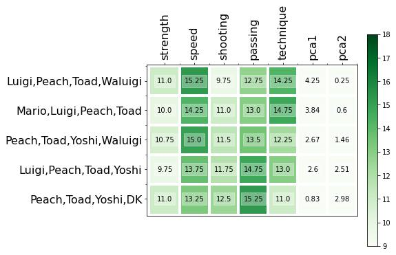
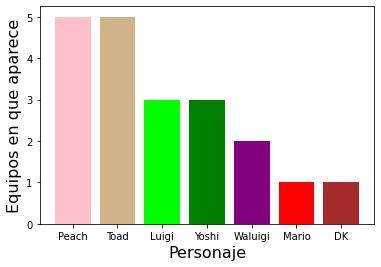

# Pareto Strikers: PCA League
###### Alberto Benavides

En este proyecto se muestran las mejores combinaciones de jugadores para el [Mario Strikers™: Battle League](https://www.nintendo.com/es-mx/store/products/mario-strikers-battle-league-switch/) a partir del uso del frente de Pareto y el análisis de componentes principales.

Aquí puede verse el [cuaderno](MarioStrikers_ParetoPCA.ipynb).

## Resultados

### Mejores equipos elegidos por frente de Pareto

### Personajes presentes en los mejores equipos
